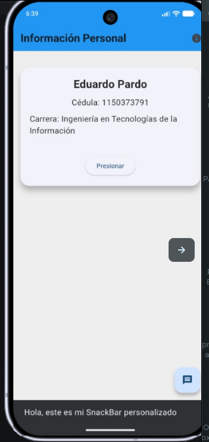

# eduardo_pardo_s1

## Autor
Eduardo Pardo

## Descripción
Aplicación desarrollada con Flutter para la materia de Programación Móvil.

## Captura de la aplicación



## Requisitos

- Flutter SDK
- Android Studio o VS Code
- Emulador Android o dispositivo físico

## Cómo ejecutar el proyecto

1. Clonar el repositorio:

```bash
git clone https://github.com/TU_USUARIO/TU_REPOSITORIO.git
```

2. Entrar a la carpeta del proyecto:

```bash
cd eduardo_pardo_s1
```

3. Instalar dependencias:

```bash
flutter pub get
```

4. Ejecutar la aplicación:

```bash
flutter run
```

## Tecnologías utilizadas

- Flutter
- Dart
- Android Studio
- Git y GitHub